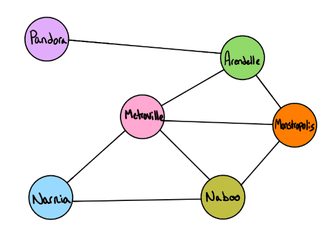
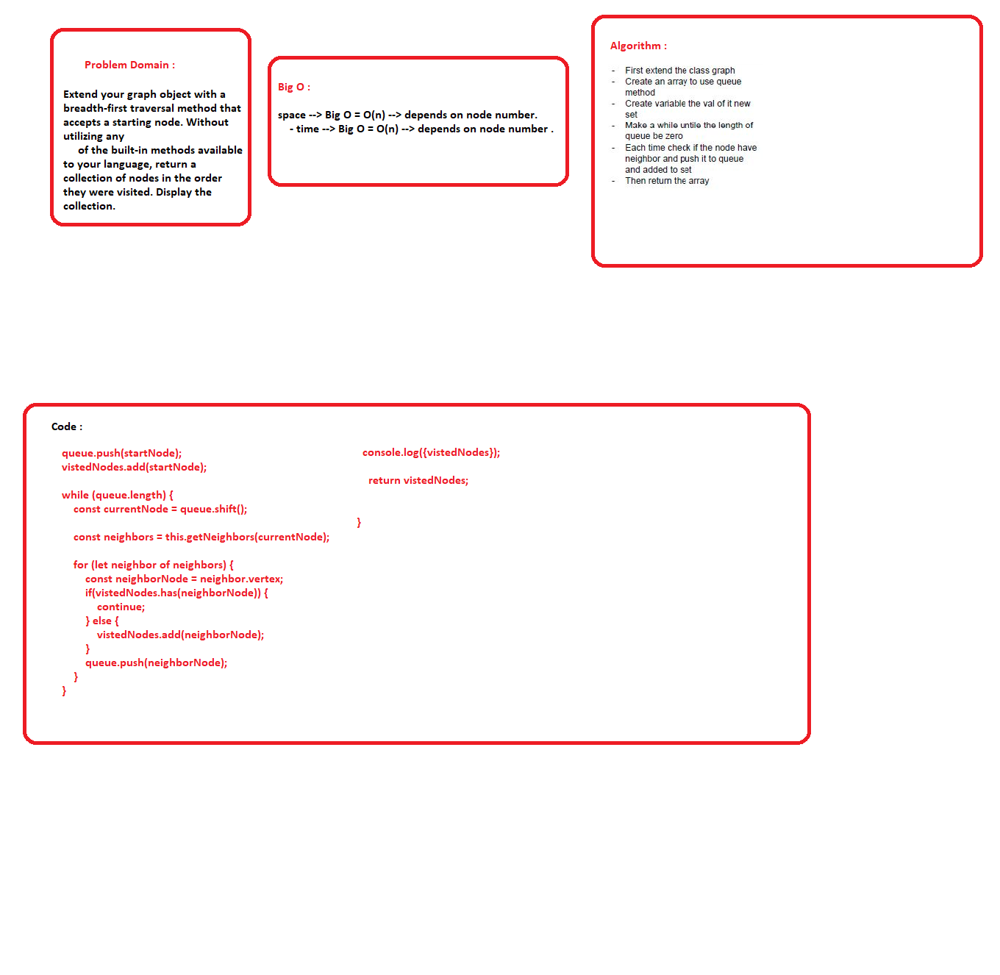

## Graph
  -  Extend your graph object with a breadth-first traversal method that accepts a starting node. Without utilizing any 
     of the built-in methods available to your language, return a collection of nodes in the order they were visited. Display the collection.

## Challenge

  - Create these methods:

           1. breadthFirst()
        

## Tests 
      
      - console.log()
    
## Big O

  breadthFirst()
    - space --> Big O = O(n) --> depends on node number.
    - time --> Big O = O(n) --> depends on node number .

  

## Whiteboard

