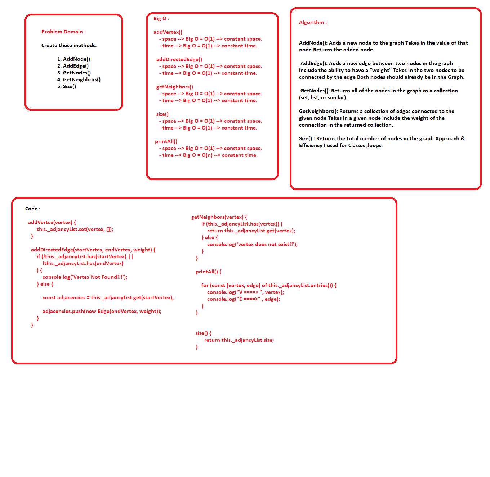

## Graph
  -  Implement Graph, The graph should be represented as an adjacency list,

## Challenge

  - Create these methods:

           1. AddNode()
           2. AddEdge()
           3. GetNodes()
           4. GetNeighbors()
           5. Size()

## Tests 
      
      - console.log()
    
## Big O

  addVertex()
    - space --> Big O = O(1) --> constant space.
    - time --> Big O = O(1) --> constant time.

  addDirectedEdge()
    - space --> Big O = O(1) --> constant space.
    - time --> Big O = O(1) --> constant time.

  getNeighbors()
    - space --> Big O = O(1) --> constant space.
    - time --> Big O = O(1) --> constant time.

  size()
    - space --> Big O = O(1) --> constant space.
    - time --> Big O = O(1) --> constant time.

 printAll()
    - space --> Big O = O(1) --> constant space.
    - time --> Big O = O(n) --> constant time.
  

## Whiteboard
