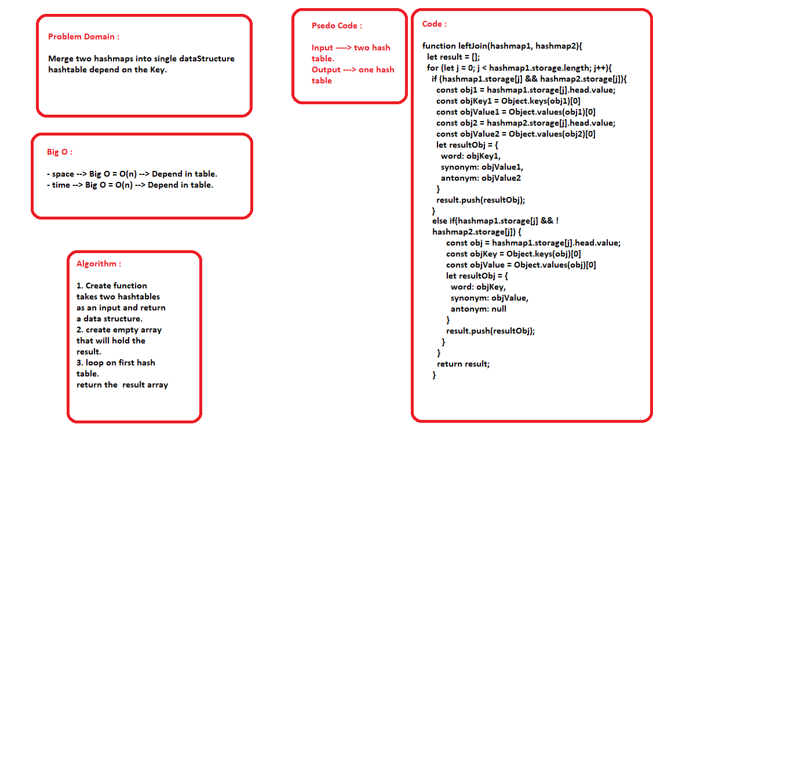

## Left Join
  -  all the values in the first hashmap are returned, and if values exist in the “right” hashmap, they are appended to
     the result row. If no values exist in the right hashmap, then some flavor of NULL should be appended to the result row.

## Challenge

  - Write a function that LEFT JOINs two hashmaps into a single data structure.

## Tests 
      
      - console.log()
    
## Big O

### leftJoin function
    - space --> Big O = O(n) --> Depend in table.
    - time --> Big O = O(n) --> Depend in table.

## Whiteboard
