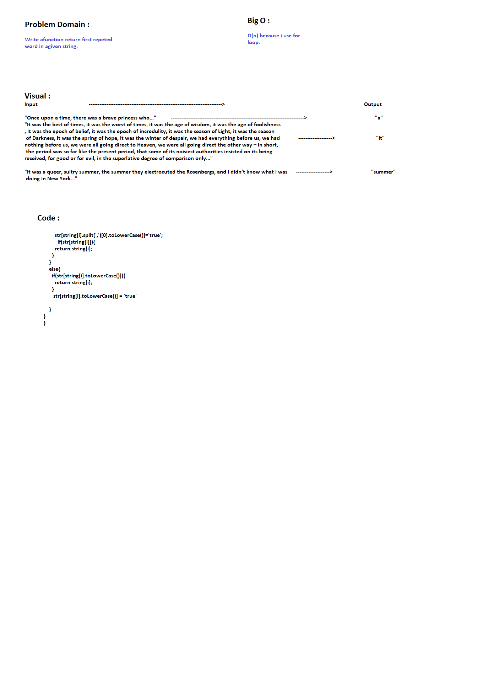

# Repeted-word :

 - Write a function that accepts a lengthy string parameter, return the first word to occur more than once in that provided string.
 
## Challenge
     
     - Crate function return first repeted word in agiven string. 

#### Tests Only for the first CC
      
      - console.log()
    
## Big O

     - O(n) ------- > because i use for loop to loop into string. 

## Solution

