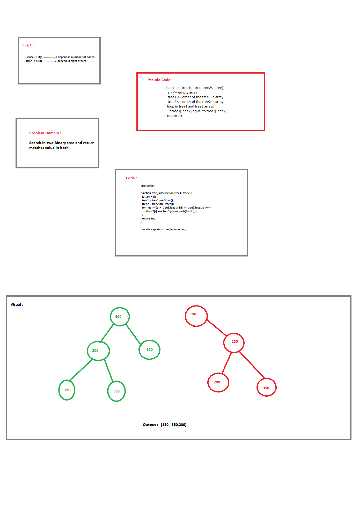

#  Tree-Insertion 

Write a function called tree_intersection that takes two binary tree parameters.

## Challenge
     
     - Create it without any build in function.

#### Tests Only for the first CC
      
      - console.log()
   

### Big O :

  - space -> O(n) -----------> depend in numbuer of nodes.
  - time -> O(h) ------------> depend in hight of tree.
    

## Solution

